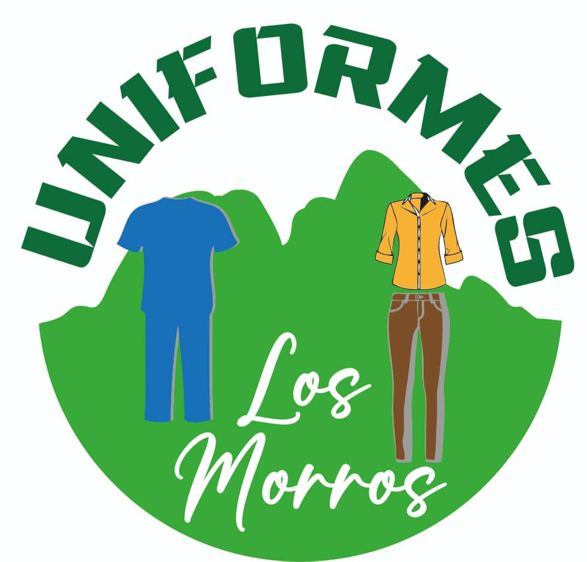

# Telares los Morros - Uniformes



Una aplicación web moderna para **Telares los Morros**, empresa textil especializada en la fabricación de uniformes profesionales y venta de materia prima al por mayor. Con más de 15 años de experiencia y presencia en 3 ubicaciones estratégicas en Venezuela.

## 🏢 Sobre la Empresa

**Telares los Morros** es una empresa textil venezolana que se dedica a:

- 👔 **Fabricación y venta de uniformes profesionales**
  - Uniformes médicos
  - Uniformes corporativos
  - Uniformes industriales
- 🧵 **Venta de materia prima textil al por mayor** para otras empresas del sector
- 📍 **Presencia nacional** con 3 sucursales estratégicas

### Ubicaciones

- **🏛️ Sede Principal**: Villa de Cura, Estado Aragua
- **🏢 Sucursal 1**: San Juan de los Morros, Estado Guárico
- **🏢 Sucursal 2**: Maracay, Estado Aragua

## 🚀 Características del Proyecto

Esta aplicación web moderna proporciona:

- ✨ **Interfaz moderna y responsive** construida con React y Tailwind CSS
- 🎨 **Animaciones fluidas** con Framer Motion
- 📱 **Diseño mobile-first** optimizado para todos los dispositivos
- 🛍️ **Catálogo de productos** interactivo
- 👤 **Sistema de autenticación** (Login/Registro)
- 📞 **Información de contacto** y ubicaciones
- 🏢 **Sección corporativa** con información de la empresa

## 🛠️ Stack Tecnológico

### Frontend

- **⚛️ React 19.1.0** - Librería principal para la interfaz de usuario
- **🎨 Tailwind CSS 3.4.17** - Framework de estilos utilitarios
- **🎭 Framer Motion 12.18.1** - Librería de animaciones
- **🧭 React Router DOM 7.6.2** - Enrutamiento del lado del cliente
- **🎯 Tabler Icons** - Iconografía moderna

### Herramientas de Desarrollo

- **⚡ Vite 6.3.5** - Build tool y servidor de desarrollo
- **🔧 ESLint** - Linter para calidad de código
- **🎨 PostCSS & Autoprefixer** - Procesamiento de CSS
- **⚡ SWC** - Compilador rápido para React

## 📁 Estructura del Proyecto

```
src/
├── components/          # Componentes reutilizables
│   ├── layout/         # Componentes de layout (Header, Footer)
│   ├── sections/       # Secciones de páginas
│   └── ui/            # Componentes de interfaz de usuario
├── pages/             # Páginas principales de la aplicación
│   ├── LandingPage.jsx    # Página de inicio
│   ├── LoginPage.jsx      # Página de inicio de sesión
│   ├── RegisterPage.jsx   # Página de registro
│   ├── AboutPage.jsx      # Página sobre nosotros
│   ├── CatalogPage.jsx    # Catálogo de productos
│   └── ContactPage.jsx    # Página de contacto
├── lib/               # Utilidades y configuraciones
├── assets/            # Recursos estáticos
├── App.jsx           # Componente principal
├── main.jsx          # Punto de entrada
└── index.css         # Estilos globales
```

## 🎨 Identidad Visual

### Paleta de Colores

- **🟢 Verde Primario**: `#28a745` - Color principal extraído del logo
- **🟡 Amarillo/Dorado**: `#ffc107` - Color de acento del logo
- **⚫ Texto Principal**: `#343a40` - Gris oscuro para legibilidad
- **⚪ Fondos**: `#ffffff` / `#f8f9fa` - Blanco y blanco hueso

### Tipografía

- **Títulos**: Montserrat/Poppins (sans-serif, negrita)
- **Texto del cuerpo**: Lato/Open Sans (legible y limpia)
- **Acentos**: Dancing Script (para elementos decorativos)

## 🚀 Instalación y Configuración

### Prerrequisitos

- Node.js 18+
- npm, yarn o pnpm

### Instalación

1. **Clonar el repositorio**

```bash
git clone <repository-url>
cd uniformes
```

2. **Instalar dependencias**

```bash
npm install
# o
yarn install
# o
pnpm install
```

3. **Iniciar servidor de desarrollo**

```bash
npm run dev
# o
yarn dev
# o
pnpm dev
```

4. **Abrir en el navegador**

```
http://localhost:5173
```

## 📜 Scripts Disponibles

```bash
# Desarrollo
npm run dev          # Inicia servidor de desarrollo

# Construcción
npm run build        # Construye la aplicación para producción

# Linting
npm run lint         # Ejecuta ESLint para verificar calidad de código

# Vista previa
npm run preview      # Previsualiza la build de producción
```

## 🌐 Rutas de la Aplicación

| Ruta        | Componente   | Descripción                                    |
| ----------- | ------------ | ---------------------------------------------- |
| `/`         | LandingPage  | Página principal con hero section y categorías |
| `/login`    | LoginPage    | Inicio de sesión para usuarios existentes      |
| `/register` | RegisterPage | Registro de nuevos usuarios/empresas           |
| `/about`    | AboutPage    | Información detallada de la empresa            |
| `/catalog`  | CatalogPage  | Catálogo de productos y servicios              |
| `/contact`  | ContactPage  | Información de contacto y ubicaciones          |

## 🎯 Funcionalidades Principales

### 🏠 Landing Page

- **Hero Section** con imágenes rotativas de productos
- **Categorías de productos** (Médicos, Corporativos, Industriales, Textiles)
- **Información corporativa** con ubicaciones
- **Sección "Sobre Nosotros"** con propuesta de valor

### 🔐 Autenticación

- **Login** para usuarios existentes
- **Registro** para nuevos clientes (individuales y empresas)
- **Validación de formularios**
- **Diseño responsive** y accesible

### 📋 Catálogo

- **Visualización de productos** por categorías
- **Información detallada** de uniformes y materiales
- **Interfaz intuitiva** para navegación

### 📞 Contacto

- **Información de las 3 sucursales**
- **Formularios de contacto**
- **Mapas de ubicación**
- **Datos de contacto** actualizados

## 🔧 Configuración de Desarrollo

### Alias de Rutas

El proyecto está configurado con alias `@` que apunta a `./src`:

```javascript
// vite.config.js
resolve: {
  alias: {
    "@": path.resolve(__dirname, "./src"),
  },
}
```

### ESLint

Configuración incluida para:

- React Hooks
- React Refresh
- Estándares de código moderno

## 🚀 Despliegue

### Build de Producción

```bash
npm run build
```

Los archivos optimizados se generarán en la carpeta `dist/`.

### Consideraciones de Despliegue

- ✅ **SPA (Single Page Application)** - Requiere configuración de servidor para rutas
- ✅ **Assets optimizados** - Vite optimiza automáticamente CSS, JS e imágenes
- ✅ **Compatibilidad con navegadores** modernos

## 🤝 Contribución

1. Fork el proyecto
2. Crea una rama para tu feature (`git checkout -b feature/AmazingFeature`)
3. Commit tus cambios (`git commit -m 'Add some AmazingFeature'`)
4. Push a la rama (`git push origin feature/AmazingFeature`)
5. Abre un Pull Request


---

_Desarrollado con ❤️ para modernizar la presencia digital de Telares los Morros_
